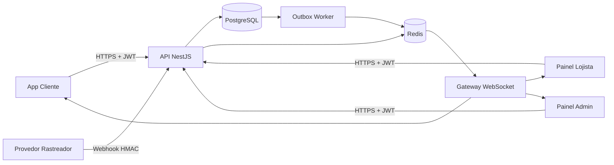

# Arquitetura — Grupo AGA

## Decisão estrutural

A primeira versão usa um **monólito modular**. É a escolha mais segura para iniciar uma operação financeira: uma transação de compra consegue alterar crédito, pedido, razão contábil, notificação e outbox no mesmo commit do PostgreSQL. Separar tudo em microsserviços logo de saída traria consistência distribuída antes de haver volume que justifique isso.

## Módulos

- `auth`: sessão, JWT, refresh rotation, bloqueio por tentativas e MFA.
- `credit`: solicitação, análise, aprovação e conta de crédito.
- `marketplace`: produtos, pedidos, autorização do cliente, razão e repasses.
- `tracking`: ingestão assinada, histórico, frota e alertas.
- `payments`: cronograma diário, intenção de pagamento e confirmação por webhook assinado.
- `protection`: apólices, cobertura e mudança de status do seguro.
- `notifications`: caixa de notificações persistente.
- `events`: transactional outbox e publicação em Redis Streams.
- `realtime`: distribuição por salas de usuário, lojista, perfil e tenant.
- `admin`: indicadores, auditoria e inspeção de eventos.

## Salas WebSocket

- `user:{userId}` — eventos privados do cliente.
- `merchant:{merchantId}` — vendas e repasses daquele lojista.
- `role:ADMIN` — visão administrativa.
- `role:FINANCE` — eventos financeiros.
- `role:TRACKING_OPERATOR` — rastreamento e alertas.
- `tenant:{tenantId}` — eventos institucionais do tenant.

O servidor decide as salas a partir do JWT. O navegador não escolhe livremente em qual sala entrar.

## Consistência financeira

Toda autorização de compra usa transação `Serializable` e atualização atômica do limite. O preço vem do banco. O lançamento contábil usa valores inteiros em centavos e três contas:

- débito em contas a receber do cliente;
- crédito no valor líquido devido ao lojista;
- crédito da taxa da plataforma.

A soma dos lançamentos precisa ser zero. Caso contrário, a transação inteira falha.

## Eventos duráveis

O mesmo commit que salva a operação cria um registro em `OutboxEvent`. Um worker publica o envelope em:

- Redis Stream `aga:events`, para retenção e consumidores confiáveis;
- canal `aga:events:realtime`, para atualização imediata das telas.

O `event.id` deve ser usado pelos consumidores para deduplicação. A entrega é pelo menos uma vez; portanto, handlers precisam ser idempotentes.

## Evolução futura

Quando houver necessidade operacional real, os primeiros candidatos a separação são:

1. ingestão de telemetria;
2. pagamentos e conciliação;
3. notificações;
4. marketplace.

O contrato de eventos permite essa separação sem mudar os três aplicativos de uma vez.
