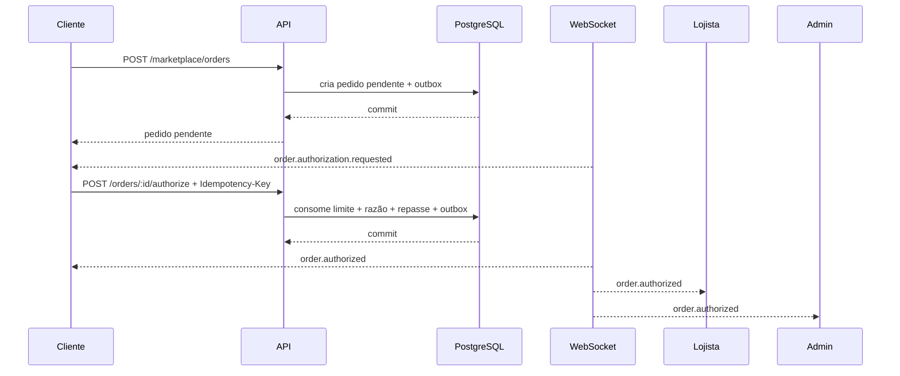

# Integração dos três aplicativos

## Princípio

Cliente, lojista e administrador compartilham a mesma API. Uma mudança é persistida uma vez e distribuída em tempo real para os perfis autorizados.

## Autenticação

```http
POST /v1/auth/login
Content-Type: application/json

{"email":"cliente@aga.local","password":"...","totpCode":"123456"}
```

A resposta entrega `accessToken`, `refreshToken` e o perfil. No aplicativo móvel, guarde o refresh token no Keychain/Keystore. Em painel web, prefira backend-for-frontend ou cookie `HttpOnly`, `Secure` e `SameSite=Strict`; não use `localStorage` para refresh token.

## WebSocket

```ts
import { io } from 'socket.io-client';
const socket = io('https://api.example.com/events', {
  auth: { token: accessToken },
  transports: ['websocket'],
});
socket.on('order.authorization.requested', event => { /* cliente */ });
socket.on('order.authorized', event => { /* cliente, lojista e admin */ });
socket.on('tracker.location.updated', event => { /* cliente e central */ });
```

Reconecte com um access token novo após refresh. Use `event.id` para ignorar duplicatas.

## Fluxo: cliente compra no app



## Fluxo: venda iniciada pelo lojista

O lojista chama `POST /v1/marketplace/orders` enviando `productId` e `clientId`. O pedido não é concluído até o cliente autorizar no aplicativo.

## Fluxo: análise de crédito

- Cliente: `POST /v1/credit/requests`.
- Admin/financeiro: `GET /v1/credit/admin/requests`.
- Admin/financeiro: `POST /v1/credit/admin/requests/:id/approve`.
- Cliente recebe `credit.request.approved`.

## Fluxo: pagamento diário

- Cliente consulta `GET /v1/payments/me`.
- Cliente cria intenção em `POST /v1/payments/:id/intent` com `Idempotency-Key`.
- O adaptador do provedor entrega checkout/PIX.
- O provedor confirma em `POST /v1/payments/provider/webhook` com HMAC.
- Cliente, financeiro e administrador recebem `payment.daily.paid` ou `payment.daily.failed`.

## Fluxo: seguro

- Cliente consulta `GET /v1/protection/me`.
- A aprovação do crédito cria uma solicitação de apólice pendente.
- Administrador/provedor ativa a apólice.
- Cliente recebe `protection.policy.activated`.

## Fluxo: rastreamento

- Provedor: `POST /v1/tracking/provider/webhook` com assinatura HMAC.
- Cliente: `GET /v1/tracking/me`.
- Admin/operador: `GET /v1/tracking/admin/fleet/all`.
- Histórico: `GET /v1/tracking/:id/history?from=&to=`.
- Tempo real: `tracker.location.updated` e `tracker.alert.created`.

## Matriz resumida

| Recurso | Cliente | Lojista | Admin | Financeiro | Rastreamento |
|---|---:|---:|---:|---:|---:|
| Ver produtos | ✓ | ✓ | ✓ | — | — |
| Criar pedido | ✓ | ✓ | — | — | — |
| Autorizar pedido | próprio | — | — | — | — |
| Ver repasses | — | próprio | ✓ | ✓ | — |
| Solicitar crédito | próprio | — | — | — | — |
| Aprovar crédito | — | — | ✓ | ✓ | — |
| Ver localização | própria | — | ✓ | suporte restrito | ✓ |
| Auditoria | — | — | ✓ | — | — |

## Idempotência

Toda operação que cria efeito financeiro deve enviar uma chave inédita:

```http
Idempotency-Key: 7c66844c-a087-4fef-89bd-d3b0747820d8
```

Se a mesma chave for repetida com o mesmo corpo, a resposta anterior é reutilizada. Se o corpo mudar, a API retorna conflito.
